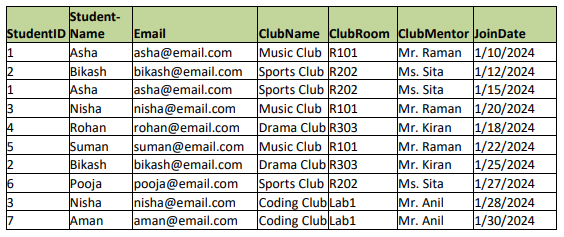
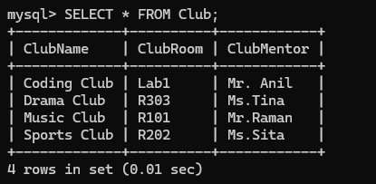
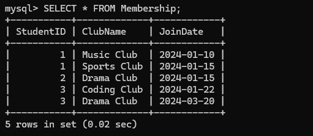
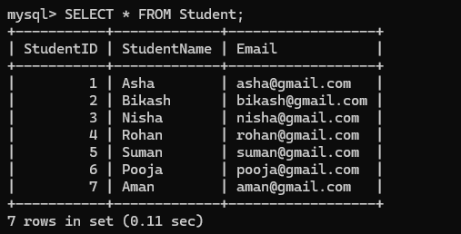

The given table above is the unnornalized form , there are few problems which are:

### Data Redundancy:

The name of the same student appears multiple times. For example we can see Asha appear two times. The details of the same club are repeated. This increases storage usages and creates inconsistency risk.

### Update Data:

If Mr.Raman changes name then we have to update data in every row containing Music Club. If one row is missed then it will lead to inconsistent database.

### Delete Data:

If we delete the only student in Drama Club then we will lose the club information completely.

The given table is not normalized. Proper normalized data is easy to manage and read. The given data about students and clubs are mixed. There are groups that have repeated a few times. Non-key attributes are depending on other non-key attributes.

The given table contains down factors like:

### Redundant Data:

Data that is unnecessarily repeated within a database which increases the usage of storage and the risk of inconsistency.

### Duplicate Data:

Exact same copies of the same record or data values stored multiple times in a table or across tables.

Factors like these two prevent the table from being normalized.

## First normal form(1NF):

The requirements for 1NF form are given below:

1. There should be atomic values
2. Primary keys should be identified

The given table is already in 1NF form. 1NF form is not an ideal form because there are problems. For example StudentID in the given table is not enough because one student can join multiple clubs. (The, 2024)

## Second normal form(2NF):

In 2NF form we have to remove partial dependency from 1NF form.
In 1NF form, StudentName and Email depend only on StudentID.
ClubRoom and ClubMentor depend only on ClubName. (The, 2024)

So, we have to separate them into different tables like:

1. Student Table:
   Student ID
   StudentName
   Email

2. Club Table:
   ClubName
   ClubRoom
   ClubMentor

3. Membership Table:
   StudentID
   ClubName
   JoinDate

In 2NF tables the primary key is StudentID. In order to change 1NF table into 2NF we have to remove partial dependency by decomposing the table.

## Third Normal form(3NF):

For the table to be 3NF the table should be in 2NF first. After that there shouldn't be any transitive dependency. Non-key attributes must depend only on the primary key.
The 2NF form of the table is also in 3NF form because in 2NF there are no transitive dependencies and the table is also decomposed into 3 tables. That is why in this scenario 2NF=3NF. No additional decomposition is required
