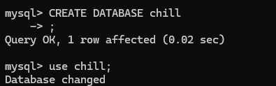
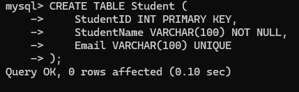
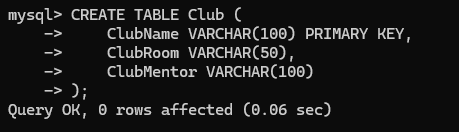
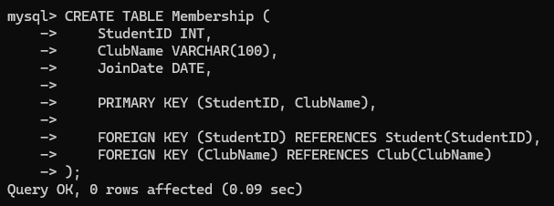
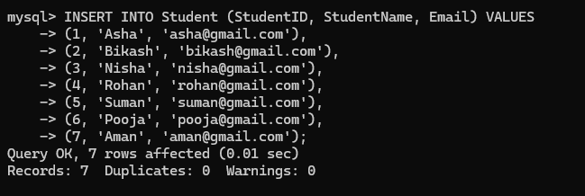
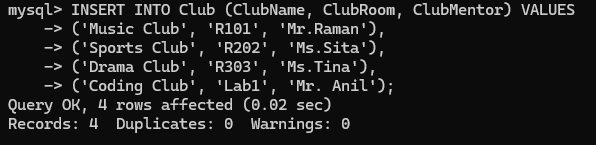
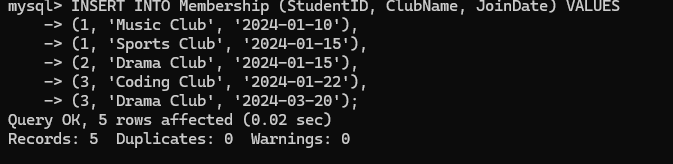
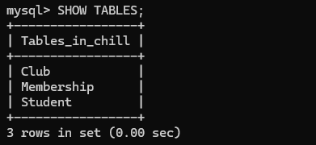

We created a new database in order to execute our commands inside it. The name of our database is chill. As we can see in the image above we created a new database named chill.

In the database we created we created a new table named Student. The student table contains 3 different rows named StudentID, StudentName and Email. The above given image shows the creation of the student table.

After creating the student table we created a club table. The image above shows the process of creating a club table. There are 3 rows in the club table which are ClubName, ClubRoom and ClubMentor.

After creating the club table, we created a membership table. The image above shows the process of making a membership table. There are 3 rows in the membership table, which are StudentID, ClubName and JoinDate. In this table StudentID and ClubName are the Primary Keys. StudentID is a foreign key which references the student table. ClubName is a Foreign Key which references the Club Table.

After creating all the tables we insert the data according to the table. In the image above we can see the process of inserting data in the student table. There are 7 columns of data inserted in the 3 rows of the table. There are a total of 21 student data in the student table.

The above image shows the process of inserting data in the club table. There are a total 4 columns of data inserted into the three rows of the table. There are a total 12 club data in the club table

The above image shows the process of inserting data in the membership table. There are a total of 5 columns of data that are inserted into the 3 different rows of the table. The table contains a total of 15 student club membership data.

The command “SHOW TABLES” shows all the tables in the database it currently is in.
