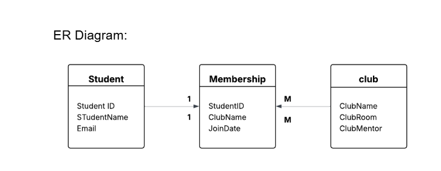

The given table above illustrates a Many to Many relationship between students and club, using the Membership table as an associative entity which acts as a bridge between them.

## The Entities:

1. Student: This entity is the parent for student data. In this entity there are student ID which is the primary key, student name and email.

2. Club: This is the parent entity for the club data. In this entity there are Clubname, club room and club mentor.

3. Membership: This entity acts as a bridge between student table and club table. Instead of listing 50 students inside one club’s row, we can create a new row here every time a student join a club.

## The Relationship:

1. Student To Membership(1:M): This line shows that one student can appear many times in the membership table. This shows a single person joining multiple clubs.

2. Club To Membership(1:M): similar to students this line shows that one club can appear many times in the membership table. This shows that one club can hold many students.

## The keys:

1. StudentID: Student ID is a foreign key which points back to the student table to identify who joined.

2. JoinDate: Joindate is an attribute on the relationship. It does not belong to student or club table, it only exists when a specific student meets a specific club.
